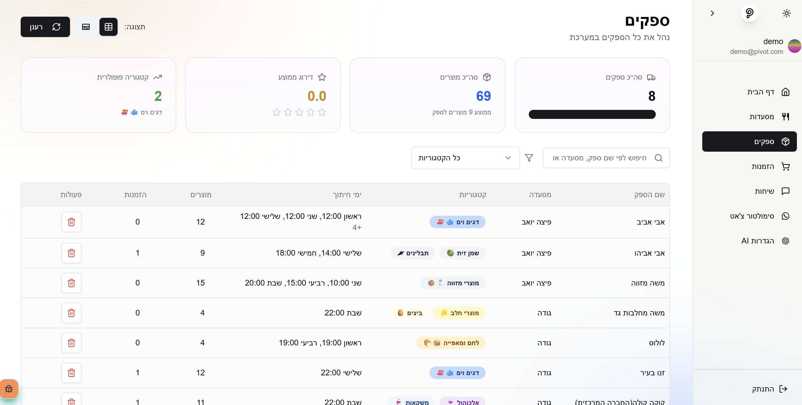

# Pivot - WhatsApp Inventory & Ordering AI Agent

<p align="center">
  
  <br>
  <em>AI-powered restaurant inventory management through WhatsApp</em>
</p>

## 💻 Technology Stack

<p align="center">
  
  
  
  
  
  
  
</p>


A multi-tenant SaaS platform that revolutionizes how restaurant owners manage suppliers, inventory, and orders through an intelligent WhatsApp bot. Pivot combines modern cloud architecture with advanced AI capabilities to create a seamless, conversation-based inventory management system.

## 🚀 Key Features

- 🕒 **Quick Onboarding**: Complete setup in under 3 minutes
- 🏪 **Self-Service**: Define suppliers & stock baselines through natural conversation
- 🔔 **Proactive Management**: Smart reminders, automated order completion and dispatch
- 📋 **Comprehensive Logging**: Track deliveries, shortages & invoices
- 📊 **Analytics Dashboard**: Powerful admin interface for operations & analytics

## 🏗️ Architecture Overview

Pivot consists of two integrated components:

### 1. Admin Dashboard

A powerful Next.js application providing restaurant owners and administrators with complete visibility and control:

- **Restaurant Management**: Add, edit, and monitor restaurant profiles
- **Supplier Management**: Track supplier performance, products, and ordering patterns
- **Order Analytics**: Visualize order history, delivery performance, and inventory trends
- **WhatsApp Simulator**: Test the conversation flow without using actual WhatsApp messages

<p align="center">
  
  
  
  
  
  
</p>

### 2. Serverless WhatsApp Bot Engine

Cloud Functions running a sophisticated state machine that powers the WhatsApp interaction:

- **Advanced Conversation State Machine**: Context-aware dialogue management
- **OpenAI Integration**: GPT-4o for natural language understanding and generation
- **Custom AI Tools**: Purpose-built functions for inventory calculation and order management
- **Structured Output Schemas**: Ensures consistent and reliable responses
- **Multi-step Workflows**: Guides users through complex processes with ease


### Frontend Technologies

- **TypeScript**: Strongly-typed programming ensuring robust code quality
- **React 18**: Component-based UI with hooks and Suspense
- **Next.js 14**: App Router with server components for optimal performance
- **shadcn/ui**: Beautifully designed components built on Radix UI
- **Tailwind CSS**: Utility-first styling with responsive design
- **TanStack Query**: Efficient data fetching and cache management

### Backend & Cloud Infrastructure

- **Firebase Firestore**: NoSQL document database with real-time capabilities
- **Cloud Functions**: Serverless compute for handling webhook events and scheduled tasks
- **Firebase Storage**: Object storage for invoices and media
- **Firebase Auth**: Secure authentication with magic links

### AI & Messaging

- **OpenAI GPT-4o**: Advanced language model for natural conversation processing
- **Function Calling**: Custom tools for inventory management and order processing
- **Structured Output**: Schema-validated responses ensuring reliable data handling
- **Twilio WhatsApp Business API**: Enterprise-grade messaging platform
- **Message Templates**: Pre-approved WhatsApp templates for consistent communication

## Project Structure

```
/
├── apps/
│   └── web-admin/      # Next.js admin panel
├── functions/          # Firebase Cloud Functions
    └──src/
        ├── types/          # Shared TypeScript types
        ├── utils/          # Twilio and Firestore functions
        └── botEngine/      # WhatsApp conversation state machine
            ├── states/     # State machine definitions
            ├── tools/      # AI function tools
            └── schemas/    # Zod validation schemas
```

## Getting Started

1. Clone the repository
2. Install dependencies: `npm install`
3. Set up environment variables (see below)
4. Start development:
   - Admin panel: `npm run dev`
   - Functions: `npm run dev:functions`

## Environment Variables

Rename `.env.example` to `.env.local` and fill in the required values:

```
# Firebase
NEXT_PUBLIC_FIREBASE_API_KEY=
NEXT_PUBLIC_FIREBASE_AUTH_DOMAIN=
NEXT_PUBLIC_FIREBASE_PROJECT_ID=
NEXT_PUBLIC_FIREBASE_STORAGE_BUCKET=
NEXT_PUBLIC_FIREBASE_MESSAGING_SENDER_ID=
NEXT_PUBLIC_FIREBASE_APP_ID=

# Twilio
TWILIO_ACCOUNT_SID=
TWILIO_AUTH_TOKEN=
TWILIO_WHATSAPP_NUMBER=

# OpenAI (for AI features)
OPENAI_API_KEY=
```

## Development Workflow

1. Make changes to the codebase
2. Run tests: `npm test`
3. Deploy:
   - Admin panel: `npm run deploy:web`
   - Functions: `npm run deploy:functions`

## License

Private

## Roadmap

- [x] Setup project structure
- [x] Implement WhatsApp webhook endpoint
- [ ] Complete conversation state machine
- [ ] Build admin dashboard
- [ ] Add supplier management
- [ ] Integrate payment processing
